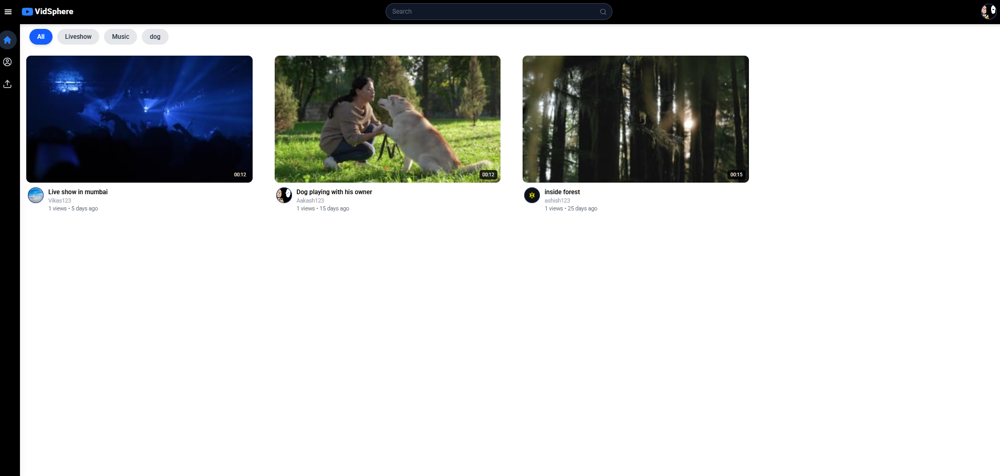
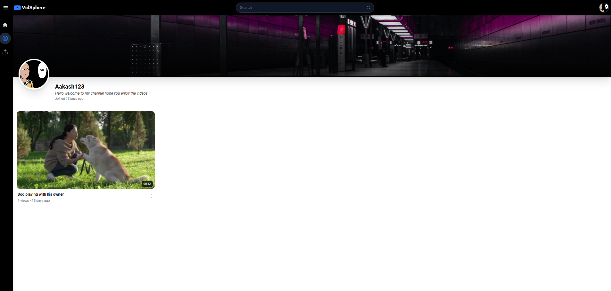
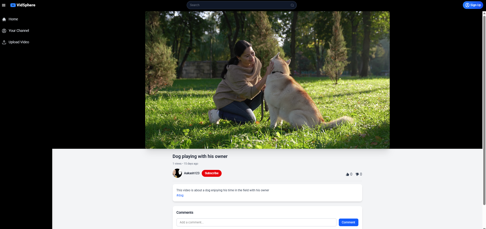
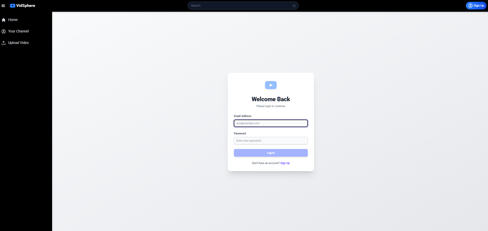
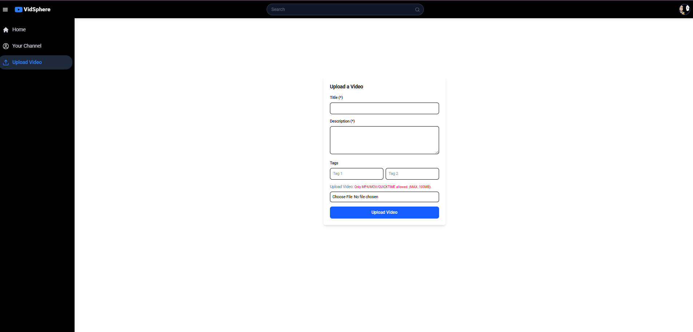

# YouTube Clone – Frontend

A fully responsive **YouTube Clone frontend** built using **React, Redux, TailwindCSS, and Axios**, replicating the core features of YouTube such as browsing, searching, watching videos, and interacting with channels.

---

## Features

- **Video Playback** – Watch videos with a custom player
- **Search** – Search videos and channels in real-time
- **Categories & Tags** – Filter videos by categories/tags
- **Comments System** – Add, view, and manage comments
- **Channel Pages** – View channel profile, banner, avatar, and videos
- **Authentication-Aware UI** – Redirects non-logged-in users to login when needed
- **Responsive UI** – Works across desktop, tablet, and mobile

---

## 🛠️ Tech Stack

- **React.js (Vite)** – Frontend framework
- **Redux Toolkit** – State management
- **React Router DOM** – Client-side routing
- **Axios** – API requests
- **Tailwind CSS** – Styling
- **React Icons** – Icons library
- **Toastify** – Notifications

---

## Project Structure

```bash
frontend/
├── public/              # Static assets
├── src/
│   ├── assets/          # Images, default avatars, etc.
│   ├── components/      # Reusable UI components
│   ├── pages/           # Main pages (Home, Video, Channel, Login, etc.)
│   ├── utiles/          # Axios instance, helpers (formatDuration, formatViews, etc.)
│   ├── App.jsx          # Root component
│   └──main.jsx          # Entry point
├── package.json
└── vite.config.js
```

---

## Getting Started

### 1. Clone the repo

```bash
git clone https://github.com/aayush-joshi1006/youtube_frontend
cd frontend
```

### 2. Install dependencies

```bash
npm install
```

### 4. Run the project

```bash
npm run dev
```

Frontend will run at: `http://localhost:5173/`

---

## Screenshots


---

---

---

---

---

## 🔗 Related

- [Backend Repository](https://github.com/aayush-joshi1006/youtube_backend)

---

## 👨‍💻 Author

**Aayush Joshi**

- GitHub: [@aayush-joshi1006](https://github.com/aayush-joshi1006)
- Email: aayushjoshi1006@gmail.com
